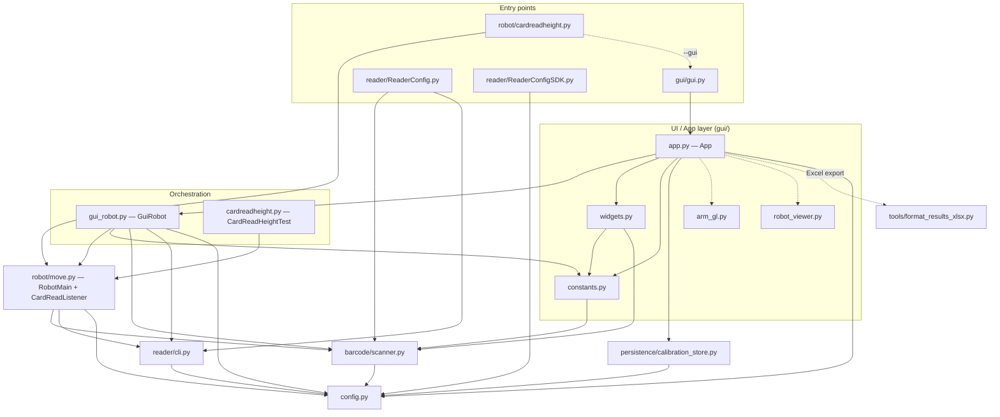

<!-- Author: Wajahat Mahmood | Updated: 2026-07-30 | rf IDEAS — Proprietary and Confidential -->

# Architecture Reference — Credential Read Height Rig

**Author:** Wajahat Mahmood **Updated:** 2026-07-30

> Engineering reference for an engineer who has never seen this code. Covers the
> layered module map, a program-structure diagram (who imports whom, and who
> deliberately does *not*), the runtime data/control flow of a test, the fixed
> file locations, and the decoupling done on 2026-07-30. Operator instructions
> live in **[USER_MANUAL.md](USER_MANUAL.md)**.

rf IDEAS — Proprietary and Confidential

---

## 1. Layered overview

The code is a layered Python application. Dependencies point **downward** only —
UI depends on orchestration, which depends on the motion core, which depends on
device helpers, which all depend on the leaf `config`. There are **no circular
imports**.

```
  Entry points:  gui/gui.py        robot/cardreadheight.py     reader/ReaderConfig.py     reader/ReaderConfigSDK.py
                     │                      │                          │                          │
  UI / App:      gui/app.py ─────────────────────────────────────────┐│                          │ (standalone HID tool,
                     │  (widgets, constants, arm_gl*, robot_viewer*)   ││                          │  config only)
  Orchestration: gui/gui_robot.py (GuiRobot)      robot/cardreadheight (CardReadHeightTest)        │
                     │            └──────────────┬───────────────────┘│                           │
  Motion core:   robot/move.py  (RobotMain, CardReadListener)         │                           │
                     │                                                 │                           │
  Devices:       barcode/scanner.py      reader/cli.py                 │                           │
                     │                        │                        │                           │
  Persistence:   persistence/calibration_store.py                     │                           │
                     │                        │                        │                           │
  Leaf config:   ───────────────────────  config.py  ─────────────────┴───────────────────────────┘
     (* = optional: loaded in try/except; the app runs without them)
```

## 2. Program-structure diagram (Mermaid)

Arrows mean **"imports / calls into."** Dashed arrows are **optional** imports
(guarded by `try/except`; the program runs if they are absent). Boxes in the same
row are peers.



**Deliberately *not* connected (important):**
- `config.py` imports **no** project module — it is the leaf/foundation.
- `tools/ros2/ros2_bridge.py` is **never imported** by the app. The GUI only
  sends it JSON over **UDP**; it runs as a **separate process** in its own ROS 2
  environment.
- `robot/test_settings.py` is used **only** by the CLI runner
  (`cardreadheight.py`), **not** by the GUI.
- `reader/ReaderConfigSDK.py` is standalone (depends on `config` only); nothing
  in the app imports it.
- `GuiRobot` (GUI) and `CardReadHeightTest` (CLI) are **parallel** orchestrators
  over the same `RobotMain`; neither imports the other.

## 3. Module-by-module reference

| Module | Responsibility | Key symbols | Imports (internal) |
|--------|----------------|-------------|--------------------|
| `config.py` | Single source of truth: robot IP, speeds, poses, height math, card-type map, path helpers | `card_face_above_table_from_tcp`, `PATHS`, `CARD_TYPE_MAP`, `CSV_FIELDS` | — (leaf) |
| `barcode/scanner.py` | Keyboard-wedge capture (`BarcodeListener`), `AllCards.csv` lookup, baseline helpers, `register_tk_text_input` | `BarcodeListener`, `lookup_card`, `register_tk_text_input`, `_typing_in_tk_entry` | `config` (`keyboard` lazy) |
| `reader/cli.py` | RRMTool_CLI wrappers: detect reader, load HWG, verify, build continuous HWG | `configure_reader_for_card`, `make_continuous_hwg`, `parse_hwg_primary_card_type` | `config` |
| `reader/ReaderConfig.py` | Standalone loop: scan barcode → configure reader (no robot) | `main` | `scanner`, `cli` |
| `reader/ReaderConfigSDK.py` | Direct USB-HID reader tool (no RRMTool) | `Reader`, `cmd_about/read/beep` | `config` |
| `robot/move.py` | **Motion core.** Home, smart-pick, barcode+config, descend-until-read, clean stop; credential read detection | `RobotMain`, `CardReadListener`, `DescentResult` | `config`, `scanner`, `cli` (`msvcrt` lazy) |
| `robot/cardreadheight.py` | CLI test runner; `--gui` delegates to the GUI | `CardReadHeightTest`, `main` | `move`, (`gui.gui` for `--gui`) |
| `robot/test_settings.py` | CLI-tunable descent params | module constants | — (CLI only) |
| `gui/gui.py` | Thin entry: build Tk root, hand off to `App` | `main` | `app` |
| `gui/app.py` | Tk UI: checklist → test-select → run → calibrator → CSV; telemetry; calibration load/save | `App`, `_TelemetryUDP` | `gui_robot`, `constants`, `widgets`, `calibration_store`, `config`, `arm_gl`*, `robot_viewer`* |
| `gui/gui_robot.py` | **Orchestration.** Barcode wave, per-angle staging, zone-in, flip, Tap-and-Go, Deadzone, Combined, telemetry, abort | `GuiRobot(RobotMain)` | `move`, `constants`, `scanner`, `cli`, `config` |
| `gui/constants.py` | Brand theme, poses, joint-limit helpers, tuning for all tests, reader library | `DESCENT_PRESETS`, `TAPGO_*`, `DEADZONE_*`, `CALIB_*`, `nearest_j6_in_range` | `config`, `scanner` |
| `gui/widgets.py` | Brand-styled Tk widget factories | `flat_button`, `number_stepper` | `constants`, `scanner` |
| `gui/arm_gl.py` | Optional embedded OpenGL Live-arm view | `ArmGLViewer` | (optional) |
| `gui/robot_viewer.py` | Optional browser three.js workcell view | `RobotViewerServer` | (optional) |
| `persistence/calibration_store.py` | **NEW.** Save/load MARK READER TOP calibration per reader model | `load_calibration`, `save_calibration`, `table_z_drifted` | `config` |
| `tools/format_results_xlsx.py` | Read-height CSV → formatted Excel | `format_read_heights_csv` | (lazy, via app) |
| `tools/…` | `Goer.py`, `cardheight.py`, `experimental/move2.py`, `ros2/ros2_bridge.py` — commissioning / experimental / separate-process helpers | — | standalone |

## 4. Runtime data & control flow (a Read Height + Tap-and-Go run)

1. **Launch** `gui/gui.py` → `App` builds the UI and, for the default reader,
   loads any saved calibration from `files/calibration.json`.
2. **Checklist** verifies arm (XArmAPI), reader (RRMTool `-about`), and barcode
   (a live `BarcodeListener`).
3. **START** → `App._run_worker` (background thread) connects the arm, builds
   `GuiRobot`, applies the selected preset, angles, flip, and the calibrated
   staging pose / reader floor, then calls `run_combined()`.
4. For each card, `GuiRobot`:
   a. Picks from the bin (`smart_pick` descends until the vacuum grabs).
   b. Moves to the scan pose and **waves** while a `BarcodeListener`
      (`force_capture=True`) reads the barcode → `lookup_card` (AllCards.csv) →
      `configure_reader_for_card` loads the `.hwg+` via RRMTool.
   c. **Read Height:** per angle, descends in zone-in taps; a `CardReadListener`
      detects the wedge read; the final slow tap's height is recorded.
   d. **Tap and Go:** per angle, plunges from ~100 mm at 500 mm/s; times the read
      in ms.
   e. Optionally flips the card and repeats for side B, then drops it.
5. Each finished card emits a **result row** onto a queue; the UI thread drains
   the queue, updates the tables, and **autosaves** the row to a CSV in
   `results/` immediately (crash-safe).
6. Live joint angles stream to the optional 3-D view and, if enabled, over UDP to
   the ROS 2 bridge — both **read-only** (no extra motion commands).

## 5. Fixed file locations the app depends on

| Path | Purpose |
|------|---------|
| `Automation/config.py` | all settings / path resolution |
| `files/AllCards.csv` | barcode → name / part / side |
| `files/hwg/*.hwg+` | per-card reader configuration files |
| `files/calibration.json` | **NEW** — saved MARK READER TOP calibration per reader |
| `files/card_readers.json` | optional legacy reader-height library |
| `results/` | output CSVs (and formatted Excel) |
| `Automation/gui/viewer/…` | 3-D viewer meshes / html / urdf |

The workspace root is the parent of `Automation/`. Do not move `files/` or
`results/` without updating `config.PATHS`.

## 6. Decoupling done 2026-07-30 (I/O vs. logic)

The motion/lookup logic used to be un-importable (and therefore untestable)
without Windows + hardware, because hardware/OS modules were imported at load
time. Two behavior-preserving changes fixed this:

- `barcode/scanner.py` now imports `keyboard` **lazily** (inside
  `BarcodeListener.start()/stop()`), so card-lookup / CSV logic imports with no
  `keyboard` package present.
- `robot/move.py` now imports `msvcrt` **lazily** (inside `_listen_for_stop()`),
  so the motion library imports on non-Windows hosts.

This is what lets the **test suite run headless** (see `tests/` and
`USER_MANUAL.md` §9). A `FakeArm` records every SDK call so refactors can be
proven to preserve the exact motion sequence.

## 7. Test strategy

`Automation/tests/` (pytest) is the safety net. It stubs `xarm`/`msvcrt`, uses a
`FakeArm`, and characterizes: height/joint geometry, per-angle staging poses, the
CSV row math for all three tests, barcode capture + AllCards lookup, HWG editing,
and calibration persistence — plus a compile-all smoke gate. Run
`python -m pytest` from `Automation/` after every change.

---

rf IDEAS — Proprietary and Confidential — 2026-07-30
